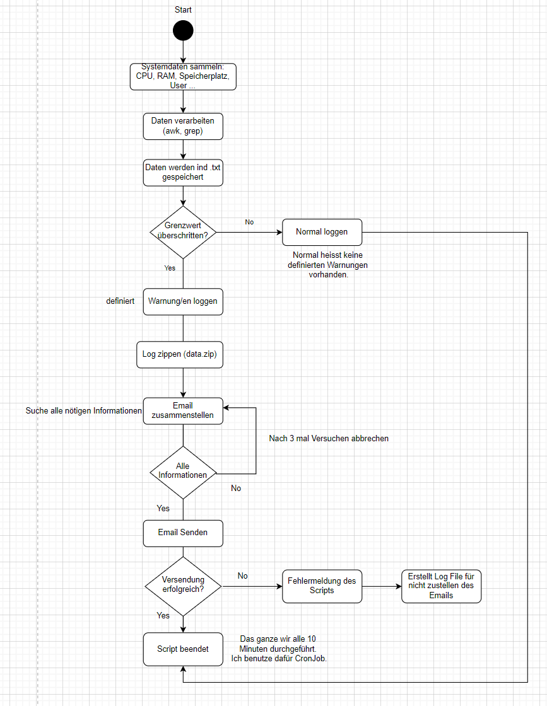

# Anforderungsdefinition: System-Monitoring & Alarm bei Überlastung
## Gruppe:
Marco und Donart
## Projektname:
**System-Monitoring mit automatischer Alarmierung per E-Mail**

## Zielsetzung
Ziel des Projekts ist die Entwicklung eines Shell-Skripts, das eigenständig wichtige Systemkennzahlen eines Linux-Servers überwacht, darunter CPU-Auslastung, RAM-Verbrauch, Festplattenplatz, Benutzeranzahl und Netzwerkstatus. Bei Überschreiten der definierten konfigurationen sendet das Skript automatisch eine E-Mail-Benachrichtigung an den Administrator. Das Skript soll automatisch starten dabei verwenden wir CronJob.

## Motivation
In produktiven Server-Umgebungen ist es sehr wichtig, dass CPU, RAM und Speicherplatz immer überwacht werden, damit nichts abstürzt. Manuelles Überprüfen kostet aber viel Zeit und kann leicht Fehler bringen. Mit diesem Projekt bauen wir eine einfache und automatische Lösung, die Probleme früh erkennt und meldet, so bleibt das System stabil und sicher.

## Anforderungen

### Muss-Kriterien
- Ein Shell-Skript zur automatischen Datenerfassung (z. B. `system_monitor.sh`)
- Konfigurierbare Grenzwerte für CPU, RAM, Speicherplatz und weitere Parameter (über Konfigurationsdatei)
- Regelmässige Ausführung durch einen Cronjob
- Automatisches Einlesen folgender Systemdaten:
  - CPU-Auslastung 
  - RAM-Verbrauch
  - Festplattenfreier Speicher 
  - Anzahl angemeldeter Benutzer
  - Netzwerkstatus 
  - Anzahl Fehlgeschlagene Login-Versuche 
- Verarbeitung und Auswertung der erfassten Daten
- Alarmierung per E-Mail bei Überschreitung von Grenzwerten (.zip)
- Erstellung eines systematischen Statusberichts (Textdatei) bei jeder Ausführung
- Fehlerbehandlung bei fehlenden oder ungültigen Daten
- Protokollierung der Skript-Ausführung in einer Logdatei

### Wunsch-Kriterien
- Webbasierte Anzeige der Systemdaten (Dashboard)

## Ein- und Ausgabedaten

### Eingabedaten

| Datenart                 | Quelle / Befehl                                | Format / Beispiel          |
|--------------------------|-----------------------------------------------|---------------------------|
| Konfigurationsdatei      | `config.cfg`                                  | Shell-Variablen, z. B. `CPU_WARN=90` |
| CPU-Auslastung           | `/proc/loadavg`                               | Dezimalzahl, z. B. 0.75   |
| RAM-Verbrauch            | `free -m`                                     | Ganzzahl in MB, z. B. 1450 |
| Speicherplatz auf `/`    | `df -h /`                                     | Text, z. B. 3.2G frei     |
| Angemeldete Benutzer     | who | wc -l                                 | Ganzzahl                  |
| Netzwerkstatus (eth0, wlan0) | `/sys/class/net/<iface>/operstate`          | Text, z. B. UP oder DOWN  |
| Fehlgeschlagene Logins   | `grep "Failed password" /var/log/auth.log`  | Ganzzahl, z. B. 4  noch genauer anschauen       |

### Ausgabedaten

| Ausgabeart       | Inhalt / Format                              | Beispiel                          |
|------------------|---------------------------------------------|----------------------------------|
| Statusbericht    | Textdatei mit Zeitstempel und Systemdaten   | `system_report_2025-06-20_13-00.log` |
| Alarm-E-Mail     | Betreff und Nachricht mit Details zum Fehler| Betreff: WARNUNG – CPU über 90%  |
| Logdatei        | Protokoll der Skriptausführungen mit Statusmeldungen | `system_monitor.log`              |

# UML Aktivitätsdiagramm 

