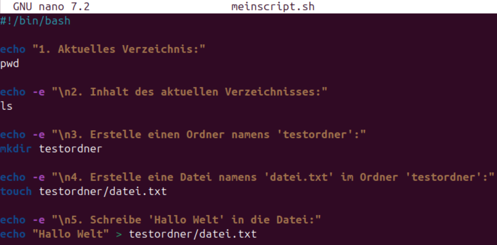

# Modul 122
## Checkpoint Linux Befehle

### Übung 1 - Repetition: Navigieren in Verzeichnissen

- cd ~
- cd /var/log
- cd /etc/udev
- cd ..
- cd newt
- cd ../../dev


### Übung 2 - Wildcards

- mkdir ~/Docs

- touch ~/Docs/file{1..10}

- rm ~/Docs/*1*

- rm ~/Docs/file{2,4,7}

- rm ~/Docs/*

- mkdir ~/Ordner

- touch ~/Ordner/file{1..10}

- cp -r ~/Ordner ~/Ordner2

- cp -r ~/Ordner ~/Ordner2/Ordner3

- mv ~/Ordner ~/Ordner1

- rm -r ~/Docs ~/Ordner1 ~/Ordner2


### Übung 3 - grep, cut (, awk)

cat << EOF > test.txt
alpha1:1alpha1:alp1ha
beta2:2beta:be2ta
gamma3:3gamma:gam3ma
obelix:belixo:xobeli
asterix:sterixa:xasteri
idefix:defixi:ixidef
EOF


grep --color=auto 'obelix' test.txt
grep --color=auto '2' test.txt
grep --color=auto 'e' test.txt
grep --color=auto -v 'gamma' test.txt
grep --color=auto -E '[123]' test.txt


cut -d':' -f1 test.txt
cut -d':' -f2 test.txt
cut -d':' -f3 test.txt


awk -F':' '{print $(NF-1)}' test.txt


### Übung 4 - Für Fortgeschrittene

dmesg | egrep '[0-9]{4}:[0-9]{2}:[0-9a-f]{2}.[0-9]'
Zeigt nur Zeilen aus dem Systemlog, in denen etwas wie eine Zeit oder Hex-Zahl vorkommt.

ifconfig | grep -oE '((1?[0-9][0-9]?|2[0-4][0-9]|25[0-5])\.){3}(1?[0-9][0-9]?|2[0-4][0-9]|25[0-5])'
Zeigt dir nur die IP-Adressen (z. B. 192.168.1.1) aus dem Netzwerkbefehl ifconfig.


### Übung 5 - stdout, stdin, stderr

cat << END > buchstaben.txt
a
b
c
d
e
END


ls -z 2> errorsLs.log


echo "Testinhalt" > testdatei.txt
cat testdatei.txt > neu.txt
cat testdatei.txt >> neu.txt
cat testdatei.txt >> neu.txt
cat neu.txt


whoami > info.txt

id >> info.txt

wc -w < info.txt


## Erstes Bash Script

Zeigt das aktuelle Verzeichnis an, in dem das Script ausgeführt wird
Listet alle Dateien und Ordner im aktuellen Verzeichnis auf
Erstellt einen neuen Ordner mit dem Namen 'testordner'
Erstellt eine neue, leere Datei im Ordner 'testordner'
Schreibt den Text 'Hallo Welt' in die Datei (überschreibt vorhandenen Inhalt)



## Erstes Bash Script

- Zeigt, wo ich gerade bin (pwd).

- Zeigt, was im Ordner drin ist (ls).

- Macht neuen Ordner namens testordner.

- Macht neue Datei datei.txt im Ordner.

- Schreibt „Hallo Welt“ in die Datei.

## Variablen

### Script

```
#!/bin/bash
BIRTHDATE="Jan 1, 2000"
Presents=10
BIRTHDAY=$(date -d "$BIRTHDATE" +%A)

if [ "$BIRTHDATE" == "Jan 1, 2000" ] ; then
    echo "BIRTHDATE ist korrekt, es ist $BIRTHDATE"
else
    echo "BIRTHDATE ist nicht korrekt"
fi
if [ $Presents == 10 ] ; then
    echo "Ich habe $Presents Geschenke bekommen."
else
    echo "Presents ist nicht korrekt"
fi
if [ "$BIRTHDAY" == "Saturday" ]||[ "$BIRTHDAY" == "Samstag" ] ; then
    echo "Ich wurde an einem $BIRTHDAY geboren."
else
    echo "BIRTHDAY ist nicht korrekt"
fi
```

## Arithmetische Operatoren (Integer)

- var=$(( Int-Arithmetik ))
- var=$[ Int-Arithmetik ]

- a + b Addition (a plus b)
- a - b Substraction (a minus b)
- a * b Multiplication (a mal b)
- a / b Division (Ganzzahl) (a geteilt durch b)
- a % b modulo (der Ganzzahlrest von a geteilt durch b)
- a ** b Potenz (a hoch b)

```
#!/bin/bash
COST_PINEAPPLE=50
COST_BANANA=4
COST_WATERMELON=23
COST_BASKET=1
TOTAL=$(($COST_PINEAPPLE + 2 * $COST_BANANA + 3 * $COST_WATERMELON + $COST_BASKET))
echo "Gesamtpreis ist: $TOTAL"
```

## Zeichenketten Verarbeitung (Strings)

```
#!/bin/bash

BUFFETT="Life is like a snowball. The important thing is finding wet snow and a really long hill."

ISAY=$BUFFETT

ISAY=${ISAY/snow/foot}
ISAY=${ISAY/snow/}
ISAY=${ISAY/finding/getting}

WET_INDEX=$(expr index "$ISAY" "w")
WET_END=$((WET_INDEX + 3))

ISAY=${ISAY:0:$WET_END}

echo "$ISAY"
```
