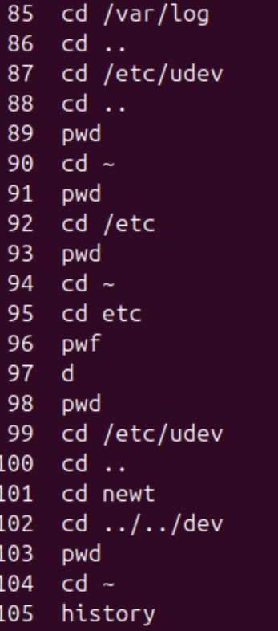
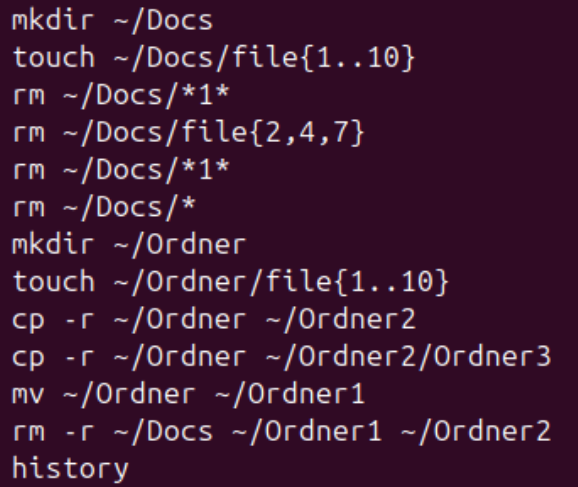
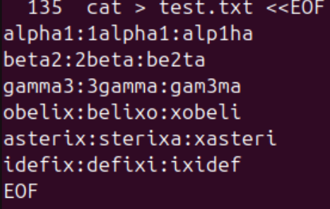
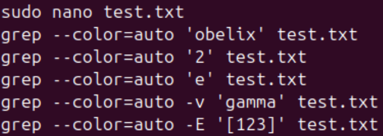
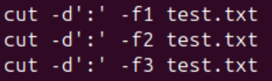
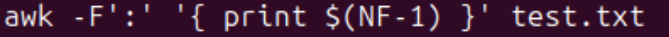
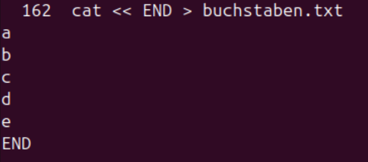
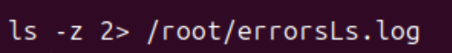
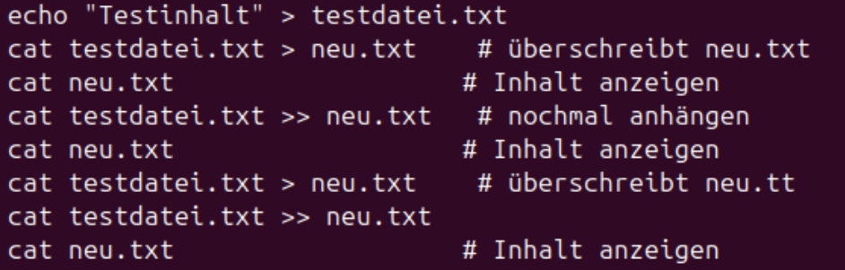
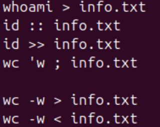

# Modul 122
## Checkpoint Linux Befehle

### Übung 1 - Repetition: Navigieren in Verzeichnissen

- cd ~
- cd /var/log
- cd /etc/udev
- cd ..
- cd newt
- cd ../../dev

### Übung 2 - Wildcards

- mkdir ~/Docs

- touch ~/Docs/file{1..10}

- rm ~/Docs/*1*

- rm ~/Docs/file{2,4,7}

- rm ~/Docs/*

- mkdir ~/Ordner

- touch ~/Ordner/file{1..10}

- cp -r ~/Ordner ~/Ordner2

- cp -r ~/Ordner ~/Ordner2/Ordner3

- mv ~/Ordner ~/Ordner1

- rm -r ~/Docs ~/Ordner1 ~/Ordner2

### Übung 3 - grep, cut (, awk)

cat << EOF > test.txt
alpha1:1alpha1:alp1ha
beta2:2beta:be2ta
gamma3:3gamma:gam3ma
obelix:belixo:xobeli
asterix:sterixa:xasteri
idefix:defixi:ixidef
EOF

grep --color=auto 'obelix' test.txt
grep --color=auto '2' test.txt
grep --color=auto 'e' test.txt
grep --color=auto -v 'gamma' test.txt
grep --color=auto -E '[123]' test.txt

cut -d':' -f1 test.txt
cut -d':' -f2 test.txt
cut -d':' -f3 test.txt

awk -F':' '{print $(NF-1)}' test.txt

### Übung 4 - Für Fortgeschrittene

dmesg | egrep '[0-9]{4}:[0-9]{2}:[0-9a-f]{2}.[0-9]'
Zeigt nur Zeilen aus dem Systemlog, in denen etwas wie eine Zeit oder Hex-Zahl vorkommt.

ifconfig | grep -oE '((1?[0-9][0-9]?|2[0-4][0-9]|25[0-5])\.){3}(1?[0-9][0-9]?|2[0-4][0-9]|25[0-5])'
Zeigt dir nur die IP-Adressen (z. B. 192.168.1.1) aus dem Netzwerkbefehl ifconfig.

### Übung 5 - stdout, stdin, stderr

cat << END > buchstaben.txt
a
b
c
d
e
END

ls -z 2> errorsLs.log

echo "Testinhalt" > testdatei.txt
cat testdatei.txt > neu.txt
cat testdatei.txt >> neu.txt
cat testdatei.txt >> neu.txt
cat neu.txt

whoami > info.txt

id >> info.txt

wc -w < info.txt

